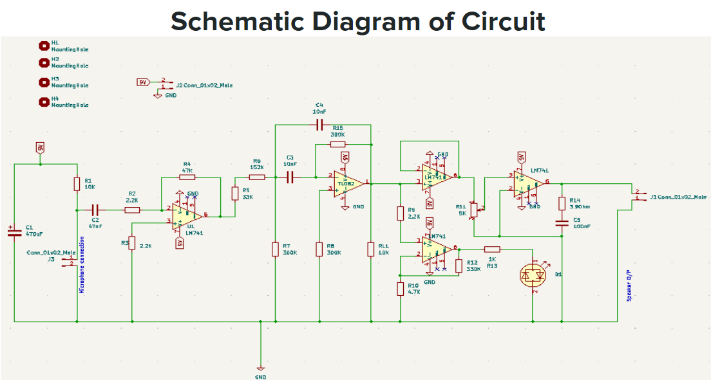

# Digital-stethoscope-for-heart-rate-monitor

Discover our user-friendly Digital Stethoscope, a smart solution for tracking heart rates accurately. This project employs cutting-edge technology to make heart rate monitoring easy and accessible. With user-friendly interfaces and advanced signal processing, our stethoscope ensures reliable results. Whether you're a healthcare professional or a curious individual, our stethoscope provides a hassle-free experience. Explore the documentation for seamless integration, and contribute to the advancement of digital healthcare. Let's revolutionize heart rate monitoring together! 🩺🔊

